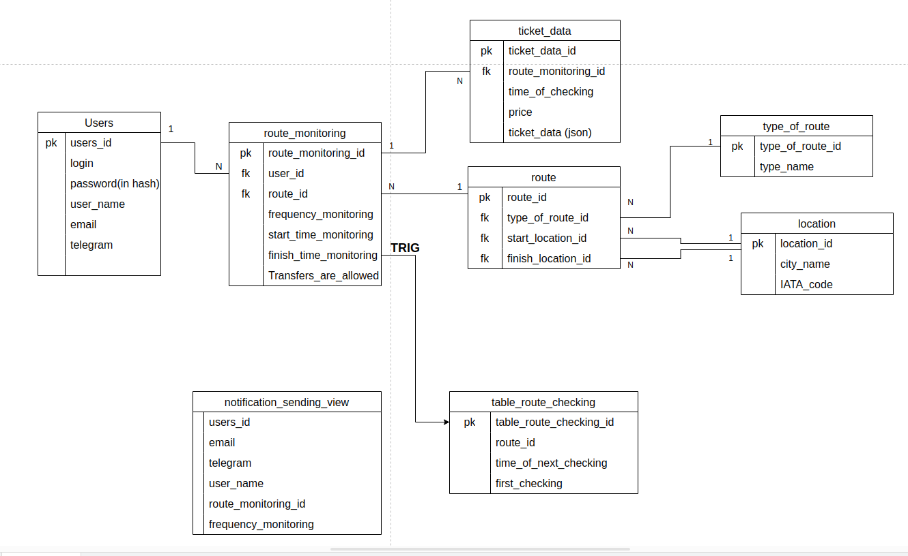

# Notification service database

Notification service database is part of [Flight ticket tracking application](https://github.com/MikhailCherepanovD/notification_service).

## Scheme of Database:

## Components

## Components

* 6 basic tables;
* `notification_sending_view` is a view for `sending_message_service`;
* `table_route_checking` is filled via a trigger;
* Indexes for all primary keys;
* Procedures and functions to simplify data insertion, updating, and deletion.

## Tech Stack
* Postgresql